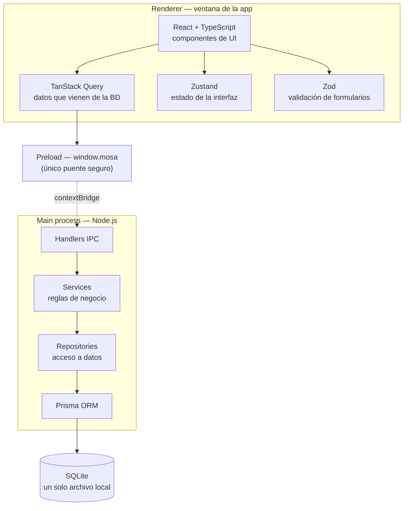
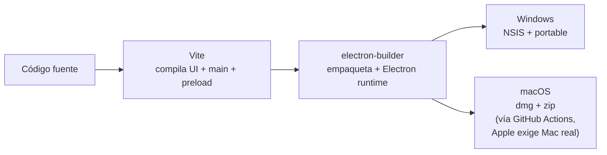

# Arquitectura y stack tecnológico — Consultorio360

## Diagrama

## Qué hace cada pieza

| Pieza | Rol |
|---|---|
| **Electron** | Envuelve todo como app de escritorio: una ventana Chromium + un proceso Node.js con acceso a archivos/SQLite. |
| **React + TypeScript** | Construye la interfaz (formularios, agenda, listas de pacientes) con tipado que atrapa errores antes de correr la app. |
| **TailwindCSS** | Estilos por clases utilitarias, sin mantener hojas CSS separadas. |
| **TanStack Query** | Trae, cachea y refresca los datos que vienen de la base de datos (pacientes, citas, recetas). Maneja loading/error solo. |
| **Zustand** | Guarda estado que es puramente de interfaz (sidebar abierta, paleta de comandos), sin relación con la base de datos. |
| **Zod** | Valida lo que el doctor escribe en un formulario antes de guardarlo. |
| **Preload (`window.mosa`)** | Único puente entre la ventana (renderer) y el proceso principal — la interfaz nunca toca Node/SQLite directamente. |
| **Services / Repositories** | Capa de main process: Services = reglas de negocio (ej. "no agendar citas superpuestas"), Repositories = únicas que hablan con Prisma. |
| **Prisma ORM** | Genera un cliente tipado a partir del esquema y traduce a SQL — sin escribir queries a mano. |
| **SQLite** | Base de datos como un solo archivo en el disco del doctor. Sin servidor, sin instalación aparte. |
| **electron-builder** | Empaqueta todo en un instalador real (`.exe`, `.dmg`). |
| **GitHub Actions** | Genera el build de macOS en un runner Mac real, porque Apple no permite hacerlo desde Windows. |

## Por qué esta secuencia de decisiones

1. **La app tiene que funcionar offline, en la computadora del doctor, sin servidor.** Eso descarta una web app común y apunta a una app de escritorio real.
2. **Electron** resuelve "app de escritorio" usando tecnologías web (más rápido de construir que UI nativa) y corre igual en Windows y Mac desde un mismo código.
3. Elegido Electron, la ventana necesita un framework de UI: **React + TypeScript** — ecosistema maduro, tipado fuerte evita bugs en formularios médicos donde un error de tipo de dato importa.
4. Para no escribir CSS a mano en cada componente: **TailwindCSS**.
5. **Sin servidor** implica que los datos tienen que vivir en el propio computador: **SQLite** — un archivo, cero configuración, cero proceso corriendo aparte.
6. Hablarle a SQLite a mano (SQL crudo) es propenso a errores y no da tipos en TypeScript: **Prisma** genera ese cliente tipado y maneja las migraciones del esquema.
7. La interfaz necesita distinguir dos tipos de estado muy distintos: datos que vienen de Prisma (**TanStack Query**, con cache/loading/refetch automático) versus estado que es solo de la pantalla (**Zustand**, sidebar, modales, etc.).
8. Antes de guardar cualquier dato del doctor hay que validarlo: **Zod**, con esquemas reusables.
9. Con la app funcionando, hace falta entregarle al doctor un instalador real, no el código fuente: **electron-builder** arma el `.exe`/`.dmg`.
10. Apple no permite generar `.dmg` fuera de macOS: **GitHub Actions** con un runner Mac resuelve eso sin comprar una Mac.
